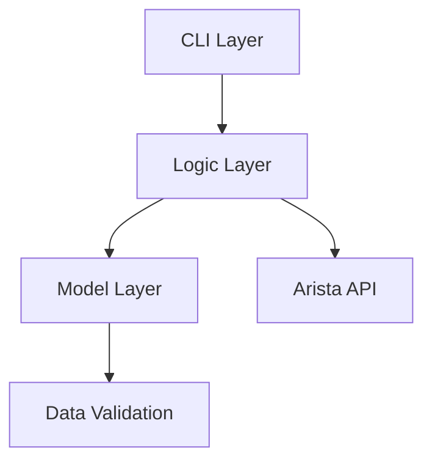

# Issues GitHub à Créer - Dette Technique
**Date**: 11 décembre 2025  
**Projet**: eos-downloader  
**Document parent**: [technical-debt-analysis-dec-2025.md](technical-debt-analysis-dec-2025.md)

---

## 📋 Instructions

Ce document liste toutes les issues GitHub à créer pour tracker la remédiation de la dette technique. Copier/coller le contenu de chaque issue dans GitHub.

**Labels à utiliser**:
- `technical-debt` - Toutes les issues de dette technique
- `security` - Problèmes de sécurité
- `enhancement` - Améliorations
- `documentation` - Documentation
- `testing` - Tests
- `refactoring` - Refactoring de code

---

## Issue #1: Support Python 3.12

```markdown
**Title**: Add Python 3.12 support

**Labels**: `enhancement`, `technical-debt`, `python`

**Description**:
The project currently supports Python 3.9, 3.10, 3.11, and 3.13 but is missing Python 3.12.

**Current State**:
- ✅ Python 3.9, 3.10, 3.11, 3.13 supported
- ❌ Python 3.12 missing

**Impact**: Medium
- Users on Python 3.12 uncertain about compatibility
- CI doesn't test Python 3.12
- Potential undetected bugs

**Effort**: Low (2 hours)

**Tasks**:
- [ ] Update `.github/python-versions.json` to include 3.12
- [ ] Run `sync-python-versions.py` script
- [ ] Verify CI tests pass for Python 3.12
- [ ] Update README if needed

**Related**:
- Technical debt analysis: #TBD
- Documentation: `.github/plans/technical-debt-analysis-dec-2025.md`

**Success Criteria**:
- [ ] CI tests all versions including 3.12
- [ ] All tests pass for Python 3.12
- [ ] pyproject.toml classifier includes 3.12
```

---

## Issue #2: Implement Token Masking for Secure Logging

```markdown
**Title**: Implement token masking for secure logging

**Labels**: `security`, `technical-debt`, `enhancement`, `priority:high`

**Description**:
Prevent accidental exposure of Arista API tokens in logs and terminal output by implementing token masking.

**Security Impact**: Medium
- Risk of credential leakage in logs
- Compliance issues
- User security best practices

**Current State**:
- ❌ Tokens logged in plaintext
- ❌ No validation of token format
- ❌ CLI token usage not warned about

**Proposed Solution**:
Create `helpers/security.py` module with:
- `mask_token()`: Display only first/last 4 chars
- `validate_arista_token()`: Validate token format
- Warning when token passed via CLI

**Effort**: Medium (3 hours)

**Tasks**:
- [ ] Create `eos_downloader/helpers/security.py`
- [ ] Implement `mask_token()` function
- [ ] Implement `validate_arista_token()` function
- [ ] Add comprehensive tests in `tests/unit/helpers/test_security.py`
- [ ] Update CLI to use token masking
- [ ] Add warning for CLI token usage vs env var
- [ ] Document best practices in security guide

**Example Usage**:
```python
from eos_downloader.helpers.security import mask_token

token = "abcdefghijklmnopqrstuvwxyz"
logger.info(f"Using token: {mask_token(token)}")
# Output: "Using token: abcd...wxyz"
```

**Related**:
- Technical debt: #TBD
- Documentation: `.github/plans/immediate-actions-tech-debt.md`

**Success Criteria**:
- [ ] Tokens masked in all log output
- [ ] Tests achieve 100% coverage
- [ ] Security guide documented
- [ ] Warning shown for CLI token usage
```

---

## Issue #3: Add detect-secrets Pre-commit Hook

```markdown
**Title**: Add detect-secrets pre-commit hook

**Labels**: `security`, `technical-debt`, `devops`, `priority:high`

**Description**:
Prevent accidental commits of secrets, credentials, and API keys using detect-secrets.

**Security Impact**: High
- Prevents credential leakage in git history
- Catches secrets before they reach remote
- Industry best practice

**Current State**:
- ❌ No pre-commit secret scanning
- ❌ Risk of accidental token commits
- ❌ No baseline for existing secrets

**Effort**: Low (1 hour)

**Tasks**:
- [ ] Install detect-secrets: `uv pip install detect-secrets`
- [ ] Create secrets baseline: `detect-secrets scan > .secrets.baseline`
- [ ] Audit detected secrets: `detect-secrets audit .secrets.baseline`
- [ ] Add hook to `.pre-commit-config.yaml`
- [ ] Test hook with sample secret
- [ ] Update contributing guide with instructions
- [ ] Add to CI pipeline for PR validation

**Pre-commit Configuration**:
```yaml
- repo: https://github.com/Yelp/detect-secrets
  rev: v1.4.0
  hooks:
    - id: detect-secrets
      args: ['--baseline', '.secrets.baseline']
      exclude: package.lock.json
```

**Related**:
- Security: #TBD (token masking)
- CI/CD: #TBD (add to pipeline)

**Success Criteria**:
- [ ] Pre-commit hook blocks secret commits
- [ ] Baseline file created and committed
- [ ] CI validates no new secrets in PRs
- [ ] Documentation updated
```

---

## Issue #4: Standardize Logging on Loguru

```markdown
**Title**: Standardize logging on loguru across all modules

**Labels**: `technical-debt`, `refactoring`, `priority:high`, `maintainability`

**Description**:
The project currently uses both `logging` (standard library) and `loguru`, creating inconsistency and maintenance burden. Standardize on `loguru` for all logging.

**Current State**:
- 📁 `arista_xml_server.py`: Uses `logging`
- 📁 `download.py`: Uses `logging`
- 📁 `cli/utils.py`: Uses `logging`
- 📁 `arista_server.py`: Uses both `logging` AND `loguru` (!)
- 📁 `version.py`: Uses `loguru` ✓

**Impact**: High
- Inconsistent log format
- Difficult to configure centrally
- Confusion for contributors
- Technical debt

**Effort**: Medium (2 weeks)

**Proposed Solution**:
1. Create centralized logging config module
2. Migrate all modules to use loguru
3. Remove all `import logging` statements
4. Update documentation

**Tasks**:

**Phase 1: Foundation** (Week 1)
- [ ] Create `eos_downloader/logging_config.py`
- [ ] Implement `configure_logging()` function
- [ ] Add tests for logging configuration
- [ ] Document logging standards

**Phase 2: Migration** (Week 2)
- [ ] Migrate `arista_xml_server.py` to loguru
- [ ] Migrate `download.py` to loguru
- [ ] Migrate `cli/utils.py` to loguru
- [ ] Fix `arista_server.py` dual logging
- [ ] Update all `logging.debug()` → `logger.debug()`

**Phase 3: Cleanup**
- [ ] Remove all `import logging` statements
- [ ] Remove pylint disables related to logging
- [ ] Update tests to use new logging config
- [ ] Verify all tests pass

**Migration Pattern**:
```python
# Before:
import logging
logging.debug("message")

# After:
from eos_downloader.logging_config import logger
logger.debug("message")
```

**Related**:
- Architecture: `.github/plans/technical-debt-analysis-dec-2025.md`
- Checklist: `.github/plans/logging-migration-checklist.md`

**Success Criteria**:
- [ ] Zero `import logging` statements remain
- [ ] All modules use `logger` from `logging_config`
- [ ] Consistent log format across all modules
- [ ] Documentation updated
- [ ] All tests pass
```

---

## Issue #5: Increase Test Coverage to 90%+

```markdown
**Title**: Increase unit test coverage from 86% to 90%+

**Labels**: `technical-debt`, `testing`, `priority:critical`, `quality`

**Description**:
Current test coverage is 86%, below the target of 90% for a production-ready tool. Critical gaps exist in error handling and edge cases.

**Current Coverage**: 86.01% (990/1151 lines)

**Target Coverage**: ≥90%

**Impact**: Critical
- Risk of undetected regressions
- Difficult to refactor safely
- Lower confidence in releases
- Missing test documentation

**Effort**: High (3 weeks)

**Under-tested Modules**:
- 🔴 `tools.py`: 50% (2/4 lines) - CRITICAL
- 🟡 `__init__.py`: 83.3% (15/18 lines)
- 🟡 CLI commands: Various gaps
- 🟡 Error paths: Many exceptions not tested

**Tasks**:

**Phase 1: Critical Modules** (Week 1)
- [ ] `tools.py`: 50% → 100% coverage
- [ ] `__init__.py`: 83% → 100% coverage
- [ ] Add missing error case tests

**Phase 2: CLI Coverage** (Week 2)
- [ ] Test all CLI commands with mocks
- [ ] Test dry-run mode extensively
- [ ] Test cache and force-download flags
- [ ] Test Docker/EVE-NG integration paths

**Phase 3: Edge Cases** (Week 3)
- [ ] Network interruption scenarios
- [ ] Checksum validation failures
- [ ] Invalid version formats
- [ ] Permission errors
- [ ] Disk space errors

**Implementation Strategy**:
```bash
# 1. Analyze current gaps
pytest --cov=eos_downloader --cov-report=html
open htmlcov/index.html

# 2. Write tests module by module
pytest tests/unit/test_tools.py --cov=eos_downloader.tools --cov-report=term-missing

# 3. Verify coverage increase
pytest --cov=eos_downloader --cov-fail-under=90
```

**Enforce in CI**:
```toml
# pyproject.toml
[tool.coverage.report]
fail_under = 90
```

**Related**:
- Plan: `.github/plans/test-coverage-improvement-v1.md`
- Analysis: `.github/plans/technical-debt-analysis-dec-2025.md`

**Success Criteria**:
- [ ] Overall coverage ≥90%
- [ ] tools.py at 100%
- [ ] __init__.py at 100%
- [ ] All CLI commands tested
- [ ] CI enforces 90% minimum
```

---

## Issue #6: Resolve Cyclic Import Dependencies in CLI

```markdown
**Title**: Resolve cyclic import dependencies in CLI module

**Labels**: `technical-debt`, `refactoring`, `priority:high`, `architecture`

**Description**:
The CLI module has cyclic imports requiring `pylint: disable=cyclic-import`, indicating architectural issues.

**Current State**:
```python
# eos_downloader/cli/cli.py
# pylint: disable=cyclic-import

from eos_downloader.cli.debug import commands as debug_commands
from eos_downloader.cli.info import commands as info_commands
from eos_downloader.cli.get import commands as get_commands
```

**Impact**: High
- Fragile architecture
- Risk of import errors
- Difficult to maintain
- Code smell indicator

**Effort**: Medium (1 week)

**Proposed Solutions**:

**Option 1: Lazy Imports** (Recommended - Quick win)
```python
@click.group()
def cli():
    pass

def register_commands():
    # Import only when needed
    from eos_downloader.cli.debug import commands as debug_commands
    cli.add_command(debug_commands.debug)
```

**Option 2: Plugin System** (Better long-term)
- Auto-discover commands via entry points
- More extensible architecture

**Tasks**:

**Phase 1: Analysis**
- [ ] Map all import dependencies with pydeps
- [ ] Identify exact circular dependencies
- [ ] Document current architecture

**Phase 2: Refactoring**
- [ ] Create `cli/registry.py` for command registration
- [ ] Implement lazy imports for commands
- [ ] Test all CLI commands still work
- [ ] Remove `pylint: disable=cyclic-import`

**Phase 3: Validation**
- [ ] Run pylint with cyclic-import check enabled
- [ ] Verify no circular imports remain
- [ ] Update architecture documentation

**Analysis Tools**:
```bash
# Install pydeps
uv pip install pydeps

# Visualize dependencies
pydeps eos_downloader/cli --show-cycles

# Check for cycles with pylint
pylint eos_downloader/cli/ --disable=all --enable=cyclic-import
```

**Related**:
- Architecture: `.github/plans/technical-debt-analysis-dec-2025.md`

**Success Criteria**:
- [ ] Zero cyclic imports
- [ ] All pylint disables removed
- [ ] Clean dependency graph
- [ ] All CLI commands functional
- [ ] Tests pass
```

---

## Issue #7: Add End-to-End Integration Tests

```markdown
**Title**: Add comprehensive End-to-End integration tests

**Labels**: `technical-debt`, `testing`, `priority:medium`, `quality`

**Description**:
The project has good unit tests but lacks E2E tests validating complete user workflows. This creates risk of integration bugs.

**Current State**:
- ✅ Strong unit tests (86% coverage)
- ❌ No E2E workflow tests
- ❌ No Docker integration tests
- ❌ No EVE-NG integration tests
- ❌ No mock Arista API tests

**Impact**: Medium-High
- Integration bugs undetected
- User workflows not validated
- Deployment confidence reduced

**Effort**: High (2 weeks)

**Missing Test Scenarios**:
1. Complete download workflow: discover → download → verify → import
2. Docker integration: download cEOS → import → verify image
3. EVE-NG integration: download vEOS-lab → install → verify
4. Cache behavior: download → cache → re-download (cached)
5. Force download: bypass cache completely
6. Network resilience: interruption → retry → success

**Tasks**:

**Phase 1: Infrastructure** (Week 1)
- [ ] Create `tests/integration/` structure
- [ ] Implement mock Arista API server
- [ ] Create reusable fixtures
- [ ] Configure pytest markers

**Phase 2: Test Implementation** (Week 2)
- [ ] Test: Complete EOS download workflow
- [ ] Test: Docker import end-to-end
- [ ] Test: EVE-NG installation end-to-end
- [ ] Test: Cache hit/miss scenarios
- [ ] Test: Network interruption handling

**Phase 3: CI Integration**
- [ ] Create `.github/workflows/integration-tests.yml`
- [ ] Configure Docker service for tests
- [ ] Run integration tests on PR
- [ ] Add status badge

**Test Structure**:
```python
# tests/integration/test_download_workflow.py
@pytest.mark.integration
def test_complete_eos_download_and_docker_import(mock_arista_api, tmp_path):
    """Test full workflow: download + verify + import."""
    # 1. Discover versions
    # 2. Download specific version
    # 3. Verify checksum
    # 4. Import to Docker
    # 5. Verify image exists
    pass
```

**Pytest Markers**:
```ini
[tool.pytest.ini_options]
markers = [
    "integration: Integration tests (slow)",
    "requires_docker: Tests requiring Docker",
    "requires_network: Tests requiring network",
]
```

**Related**:
- Coverage: #TBD (test coverage improvement)
- CI/CD: `.github/workflows/integration-tests.yml`

**Success Criteria**:
- [ ] 10+ E2E test scenarios
- [ ] Mock Arista API implemented
- [ ] CI runs integration tests
- [ ] All critical workflows tested
- [ ] Documentation updated
```

---

## Issue #8: Complete Technical Documentation

```markdown
**Title**: Complete technical documentation for architecture and development

**Labels**: `technical-debt`, `documentation`, `priority:medium`

**Description**:
The project has good user documentation but lacks technical documentation for architecture, design decisions, and development guides.

**Current State**:
- ✅ README.md (excellent)
- ✅ Contributing guide
- ❌ Architecture Decision Records (ADRs)
- ❌ Architecture diagrams
- ❌ Debugging guide
- ❌ Release process guide
- ❌ Detailed API reference

**Impact**: Medium
- Steep learning curve for contributors
- Undocumented design decisions
- Repeated questions
- Knowledge silos

**Effort**: Medium (2 weeks)

**Tasks**:

**Phase 1: Architecture** (Week 1)
- [ ] Create `docs/dev-notes/architecture.md`
- [ ] Create architecture diagrams (Mermaid)
- [ ] Document layer separation (CLI → Logic → Model)
- [ ] Document data flow

**Phase 2: ADRs** (Week 1)
- [ ] Create `docs/dev-notes/adr/` directory
- [ ] ADR-001: Use UV for package management
- [ ] ADR-002: Standardize on loguru for logging
- [ ] ADR-003: Click for CLI framework
- [ ] ADR template for future decisions

**Phase 3: Development Guides** (Week 2)
- [ ] `docs/dev-notes/debugging-guide.md`
- [ ] `docs/dev-notes/release-process.md`
- [ ] `docs/dev-notes/testing-strategy.md`
- [ ] `docs/api/arista-api-reference.md`

**ADR Template**:
```markdown
# ADR-NNN: Title

## Status
Proposed | Accepted | Deprecated | Superseded

## Context
What is the issue we're trying to solve?

## Decision
What is the change we're proposing?

## Consequences
What are the positive and negative outcomes?

## Alternatives Considered
What other options did we evaluate?
```

**Architecture Diagram Example**:


**Related**:
- Standards: `.github/instructions/markdown.instructions.md`
- Examples: `.github/plans/`

**Success Criteria**:
- [ ] 5+ ADRs documented
- [ ] Architecture diagrams created
- [ ] Debugging guide complete
- [ ] Release process documented
- [ ] API reference complete
- [ ] MkDocs builds successfully
```

---

## Issue #9: Optimize CI/CD Pipeline Performance

```markdown
**Title**: Optimize CI/CD pipeline for faster execution

**Labels**: `technical-debt`, `devops`, `priority:low`, `performance`

**Description**:
Current CI/CD workflows can be optimized to reduce execution time and resource usage.

**Current Performance**:
- Total CI time: ~15 minutes (needs baseline measurement)
- Multiple sequential jobs
- Some redundant caching

**Target**: Reduce by 20-30%

**Impact**: Medium
- Faster feedback for developers
- Lower CI resource costs
- Better developer experience

**Effort**: Medium (1 week)

**Optimization Opportunities**:

**1. Enhanced Caching**
```yaml
- name: Cache UV and venv
  uses: actions/cache@v4
  with:
    path: |
      ~/.cache/uv
      .venv
    key: uv-${{ runner.os }}-${{ hashFiles('**/pyproject.toml') }}
    restore-keys: |
      uv-${{ runner.os }}-
```

**2. Conditional Execution**
```yaml
on:
  pull_request:
    paths-ignore:
      - '**.md'
      - 'docs/**'
      - '.github/plans/**'
```

**3. Job Parallelization**
```yaml
jobs:
  lint:
    # Runs in parallel with tests
  test:
    # Runs in parallel with lint
  integration:
    needs: [test]  # Only after tests pass
```

**Tasks**:

**Phase 1: Baseline**
- [ ] Measure current CI execution times
- [ ] Identify slowest jobs
- [ ] Document bottlenecks

**Phase 2: Implementation**
- [ ] Implement enhanced caching
- [ ] Add path-based triggers
- [ ] Parallelize independent jobs
- [ ] Optimize Docker builds

**Phase 3: Validation**
- [ ] Measure new execution times
- [ ] Calculate improvement percentage
- [ ] Document changes

**Metrics to Track**:
```yaml
- Total pipeline time
- Individual job times
- Cache hit rates
- Resource usage
```

**Related**:
- Workflows: `.github/workflows/pr-management.yml`
- Best practices: `.github/instructions/github-actions-ci-cd-best-practices.instructions.md`

**Success Criteria**:
- [ ] 20-30% reduction in CI time
- [ ] Cache hit rate >80%
- [ ] All tests still pass
- [ ] Documentation updated
```

---

## Issue #10: Document Security Best Practices

```markdown
**Title**: Create comprehensive security best practices guide

**Labels**: `security`, `documentation`, `priority:high`

**Description**:
With token masking and detect-secrets implemented, create a comprehensive security guide for users and contributors.

**Current State**:
- ❌ No security documentation
- ❌ Token handling not documented
- ❌ Best practices unclear

**Impact**: High
- User security awareness
- Compliance requirements
- Professional image

**Effort**: Low (4 hours)

**Tasks**:

**Phase 1: User Guide**
- [ ] Create `docs/usage/security.md`
- [ ] Document token management
- [ ] Environment variable best practices
- [ ] Token rotation procedures

**Phase 2: Developer Guide**
- [ ] Create `docs/dev-notes/security.md`
- [ ] Document security checklist
- [ ] Code review security guidelines
- [ ] Secrets handling in code

**Content Structure**:

**User Security Guide**:
```markdown
## Token Management

### ❌ Don't Do This
```bash
ardl --token YOUR_TOKEN get eos
```

### ✅ Do This Instead
```bash
export ARISTA_TOKEN="your-token"
ardl get eos
```

## Token Rotation
1. Generate new token on arista.com
2. Test with new value
3. Update environments
4. Revoke old token
```

**Developer Security Guide**:
```markdown
## Security Checklist

Before PR:
- [ ] No hardcoded credentials
- [ ] Tokens properly masked in logs
- [ ] detect-secrets passes
- [ ] Security tests added
```

**Related**:
- Token masking: #TBD
- detect-secrets: #TBD

**Success Criteria**:
- [ ] User security guide published
- [ ] Developer security guide published
- [ ] Documentation includes examples
- [ ] Links from README
```

---

## 📋 Issue Creation Checklist

Avant de créer ces issues sur GitHub:

- [ ] Lire chaque issue complètement
- [ ] Ajuster les numéros d'issues liées (remplacer `#TBD`)
- [ ] Ajouter les labels appropriés
- [ ] Assigner à un milestone si applicable
- [ ] Lier au projet "Technical Debt Remediation"
- [ ] Ajouter à la board/kanban appropriée

---

## 🔗 Liens Utiles

- **Template d'issue**: `.github/ISSUE_TEMPLATE/chore_request.yml`
- **Labels**: https://github.com/titom73/eos-downloader/labels
- **Milestones**: https://github.com/titom73/eos-downloader/milestones
- **Projects**: https://github.com/titom73/eos-downloader/projects

---

**Créé**: 11 décembre 2025  
**Total d'issues**: 10  
**Priorité**: 5 critiques/hautes, 3 moyennes, 2 basses
