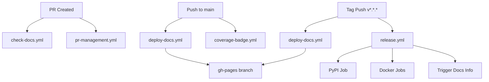

# GitHub Actions Workflows

This directory contains all GitHub Actions workflows for the `eos-downloader` project.

## Overview

The project uses GitHub Actions for continuous integration, testing, documentation deployment, and release management.

## Workflows

### 📚 Documentation Workflows

#### [`check-docs.yml`](check-docs.yml)
**Purpose:** Validate documentation builds correctly on pull requests

**Triggers:**
- Pull requests to `main` branch
- Changes to: `docs/**`, `mkdocs.yml`, `eos_downloader/**`, `README.md`
- Manual dispatch

**What it does:**
- Validates MkDocs builds without errors (`--strict` mode)
- Tests mike version management locally
- Uploads build artifacts for inspection
- Does NOT deploy to GitHub Pages

**Use case:** Catch documentation errors before merging PRs

---

#### [`deploy-docs.yml`](deploy-docs.yml)
**Purpose:** Deploy documentation to GitHub Pages with versioning

**Triggers:**
- Push to `main` branch (deploys as `main` with alias `development`)
- Tag push `v*.*.*` (deploys as tag version with alias `stable`)
- Manual dispatch (custom version and alias)

**What it does:**
- Builds documentation with MkDocs
- Deploys using mike for version management
- Pushes to `gh-pages` branch
- Sets default version (for releases)
- Creates deployment summary

**Use cases:**
- Automatic deployment of development docs on `main` updates
- Automatic deployment of versioned docs on release
- Manual deployment of specific versions

**Version Strategy:**
```
main → deployed as "main" with alias "development"
v0.13.0 → deployed as "v0.13.0" with alias "stable" (set as default)
v0.14.0 → deployed as "v0.14.0" with alias "stable" (updates default)
```

---

### 🚀 Release Workflows

#### [`release.yml`](release.yml)
**Purpose:** Publish package to PyPI and Docker registries on version tags

**Triggers:**
- Tag push `v*.*.*`

**What it does:**
1. **PyPI Job:** Builds and publishes Python package to PyPI
2. **Docker Job:** Builds and pushes Docker image to Docker Hub and GHCR
3. **Docker-in-Docker Job:** Builds variant with Docker support
4. **Trigger Docs Job:** Informs that documentation deployment is handled by `deploy-docs.yml`

**Use case:** Automated release process when creating version tags

**Dependencies:**
- Requires `PYPI_API_TOKEN` secret
- Requires `DOCKERHUB_USERNAME` and `DOCKER_PASSWORD` secrets
- Requires `DOCKER_IMAGE` secret (repository name)

---

### 🧪 Testing Workflows

#### [`pr-management.yml`](pr-management.yml)
**Purpose:** Run tests, linting, and code quality checks on pull requests

**Triggers:**
- Pull requests to `main` branch
- Manual dispatch

**What it does:**
- Runs pytest with coverage
- Runs linting (flake8, pylint)
- Runs type checking (mypy)
- Reports coverage results
- Validates code quality

**Use case:** Ensure code quality before merging PRs

---

#### [`coverage-badge.yml`](coverage-badge.yml)
**Purpose:** Update coverage badge in repository

**Triggers:**
- Push to `main` branch
- Manual dispatch

**What it does:**
- Runs tests with coverage
- Generates coverage badge
- Commits badge to repository

**Use case:** Keep coverage badge up to date

---

### 🔧 Utility Workflows

#### [`on_demand.yml`](on_demand.yml)
**Purpose:** Manual workflow for testing or specific operations

**Triggers:**
- Manual dispatch only

**What it does:**
- Customizable workflow for ad-hoc operations

**Use case:** Manual testing or specific maintenance tasks

---

## Workflow Dependencies



## Secrets Required

The following secrets must be configured in the repository settings:

### PyPI Publishing
- `PYPI_API_TOKEN`: API token for publishing to PyPI

### Docker Publishing
- `DOCKERHUB_USERNAME`: Docker Hub username
- `DOCKER_PASSWORD`: Docker Hub password/token
- `DOCKER_IMAGE`: Docker image repository name (e.g., `titom73/eos-downloader`)

### Automatic Secrets
- `GITHUB_TOKEN`: Automatically provided by GitHub Actions (no configuration needed)

## Permissions

### Documentation Workflows
- `contents: write` - Required to push to `gh-pages` branch

### Release Workflows
- `id-token: write` - Required for PyPI trusted publishing

## Environment Configuration

### PyPI Environment
- Name: `pypi`
- URL: `https://pypi.org/p/eos-downloader`
- Protection rules: None (can be added for manual approval)

### GitHub Pages
- Source: `gh-pages` branch
- Path: `/` (root)
- Custom domain: None (can be configured)

## Common Operations

### Testing Documentation Locally

```bash
# Install dependencies
pip install -e ".[doc]"

# Serve documentation locally
mkdocs serve

# Build documentation
mkdocs build --strict

# Test mike deployment (creates local commit, no push)
mike deploy test-build test
mike list
# To undo: git reset --soft HEAD~1
```

### Manual Documentation Deployment

```bash
# Deploy development version
mike deploy --push main development

# Deploy release version
mike deploy --push v0.13.0 stable

# Set default version
mike set-default --push stable

# Delete version
mike delete --push old-version
```

### Creating a Release

```bash
# 1. Update version in pyproject.toml
# 2. Commit changes
git add pyproject.toml
git commit -m "chore: bump version to v0.14.0"

# 3. Create and push tag
git tag v0.14.0
git push origin v0.14.0

# This automatically triggers:
# - release.yml → PyPI + Docker + Docker-in-Docker
# - deploy-docs.yml → Documentation deployment
```

### Troubleshooting Workflows

```bash
# Check workflow runs
gh run list

# View specific workflow run
gh run view <run-id>

# View logs
gh run view <run-id> --log

# Re-run failed workflow
gh run rerun <run-id>

# Trigger manual workflow
gh workflow run deploy-docs.yml
```

## Best Practices

1. **Always test locally** before pushing to main or creating tags
2. **Use draft PRs** for work in progress
3. **Review workflow logs** for any warnings or issues
4. **Keep secrets secure** - never commit secrets to the repository
5. **Monitor workflow runs** - ensure all checks pass before merging
6. **Update documentation** when modifying workflows

## Maintenance

### Regular Tasks
- Review and update GitHub Actions versions monthly
- Monitor for security advisories on used actions
- Update Python version in workflows when new versions are released
- Review and prune old documentation versions periodically

### Version Updates
When updating action versions, check:
- Breaking changes in release notes
- New features that can be utilized
- Security patches and improvements

Example:
```yaml
# Check for updates
actions/checkout@v5  # Latest major version
actions/setup-python@v6  # Keep up to date
```

## References

- [GitHub Actions Documentation](https://docs.github.com/en/actions)
- [MkDocs Documentation](https://www.mkdocs.org/)
- [Mike Documentation](https://github.com/jimporter/mike)
- [PyPI Publishing with GitHub Actions](https://packaging.python.org/en/latest/guides/publishing-package-distribution-releases-using-github-actions-ci-cd-workflows/)
